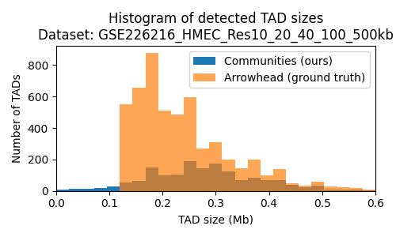
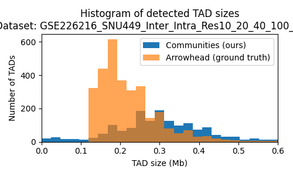

# Computational Genomics - Project 2
Authors: Agata Kaczmarek, Władysław Olejnik, Mateusz Stączek

The aim of this project is to identify the topologically associating domains (TADs) on the basis of the heatmap from Hi-C experiment.

## Data
The data we chose for this project is available in `\data` directory. The source of the data are as following: 
 - `GSE226216_HMEC_Res10_20_40_100_500kb` - 575MB,
 - `GSE226216_Huh1_Inter_Intra_Res10_20_40_100_500kb` - 573MB,
 - `GSE226216_SNU449_Inter_Intra_Res10_20_40_100_500kb` - 584MB.
 
https://www.ncbi.nlm.nih.gov/geo/query/acc.cgi?acc=GSE226216 - Hi-C sequencing. Limited resolutions to 10kb, 20kb, 40kb, 100kb and 500kb (fine for us). 

## Chosen approach
To solve the problem we used graph representation of interactions.

## Evaluation
As a ground truth for our algorithm we chose the results from the Arrowhead method. The evaluation of our solution with the description and interpretation of the results is in file `metrics_evaluation.ipynb`.

## Results

Histograms of TAD sizes.

CSV with metrics:

|                                      | GSE226216_HMEC | GSE226216_Huh1_Inter_Intra | GSE226216_SNU449_Inter_Intra |
|--------------------------------------|----------------|----------------------------|------------------------------|
| Balanced accuracy                    | 0.4982         | 0.4987                     | 0.4988                       |
| Jaccard index                        | 0.0352         | 0.0375                     | 0.0391                       |
| Average match for our communities    | 10.0653        | 7.3435                     | 8.0747                       |
| Average match for arrowhead          | 8.4884         | 6.3027                     | 6.6706                       |

## Structure of the repository:
- `\data` - directory with the raw data we used,
- `\processed_data` - directory with the TADs found by us and Arrowhead method,
- `\results` - direstory with all results we got from the processing, both with histograms and csv with metrics,
- `metrics_and_results.ipynb` - file with metrics evaluation and the results,
- `run_Arrowhead.sh` - script to run Arrowhead method on the raw data, takes a lot of time,limit RAM or will use up to 38.6GB on Colab.
